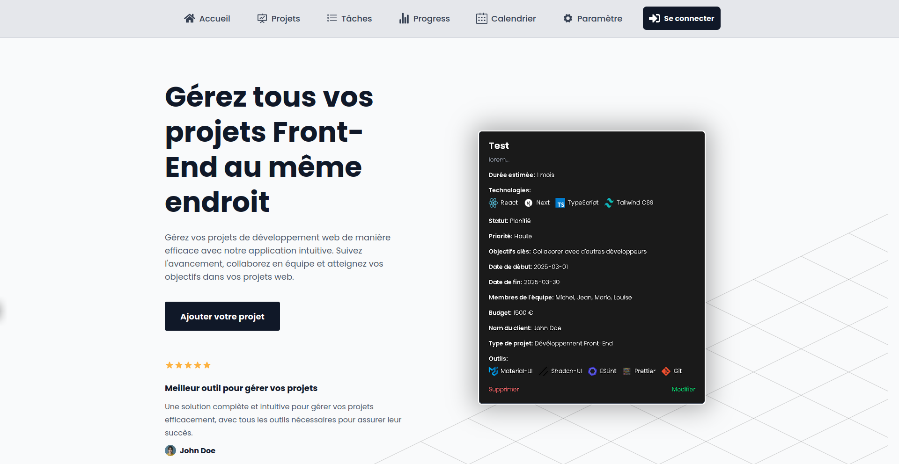

# 🚀 Project Manager 🚀

A modern project management tool for frontend developers

## 🚧 Status: In Development

This project is currently under active development. Features and functionality are being added and refined regularly. We're working hard to bring you the best project management experience possible!

## 📝 Description

Project Manager is a comprehensive web application designed to help frontend developers manage their projects efficiently. Built with React, TypeScript, and Tailwind CSS, it offers an intuitive interface for tracking project progress, managing tasks, and organizing development workflows.

The application features a modern, dark-themed interface with a focus on user experience and productivity. Whether you're working solo or with a team, Project Manager provides all the tools you need to keep your projects on track.

## ✨ Features

### Current Features

- 📊 **Project Dashboard**

  - Overview of all active projects
  - Quick access to recent activities
  - Project status indicators
  - Progress tracking widgets

- 📝 **Project Creation & Management**

  - Intuitive project creation wizard
  - Detailed project information forms
  - Custom project templates
  - Project archiving capabilities

- 🏷️ **Project Status Tracking**

  - Real-time status updates
  - Custom status definitions
  - Status history tracking
  - Automated status notifications

- 💻 **Technology Stack Selection**

  - Predefined technology options
  - Custom technology addition
  - Visual technology badges
  - Stack compatibility checking

- ⏱️ **Duration Estimation**

  - Timeline planning tools
  - Milestone setting
  - Deadline tracking
  - Automated reminders

- 🎯 **Project Objectives Setting**

  - SMART goal framework
  - Objective tracking
  - Progress indicators
  - Goal achievement metrics

- 👥 **Team Member Management**

  - Team role assignment
  - Member responsibility tracking
  - Team communication tools
  - Workload management

- 💰 **Budget Tracking**

  - Cost estimation tools
  - Budget monitoring
  - Expense tracking
  - Financial reporting

- 📅 **Project Timeline Management**
  - Interactive timeline view
  - Dependency mapping
  - Critical path identification
  - Timeline adjustments

### Planned Features

- 📋 **Kanban Board**

  - Customizable columns
  - Drag-and-drop functionality
  - Task filtering and sorting
  - Sprint planning support

- 📊 **Statistics & Analytics**

  - Performance metrics
  - Time tracking analysis
  - Project health indicators
  - Custom report generation

- 📅 **Calendar Integration**

  - Google Calendar sync
  - Event management
  - Deadline visualization
  - Meeting scheduling

- 🔄 **Task Management**

  - Task dependencies
  - Priority settings
  - Time estimation
  - Progress tracking

- 📈 **Progress Tracking**

  - Burndown charts
  - Velocity tracking
  - Sprint metrics
  - Team performance analytics

- 🤝 **Team Collaboration Tools**
  - Real-time chat
  - Document sharing
  - Comment threads
  - @mentions support

## 🛠️ Tech Stack

- **Frontend Framework:** React 19.0.0

  - Modern component architecture
  - Functional components with hooks
  - Performance optimized

- **Language:** TypeScript 5.7.2

  - Strong type safety
  - Enhanced developer experience
  - Reduced runtime errors

- **Styling:** Tailwind CSS 4.0.6

  - Custom design system
  - Responsive layouts
  - Dark mode support

- **Routing:** React Router v7

  - Client-side routing
  - Protected routes
  - Dynamic route handling

- **State Management:** React Context

  - Centralized state management
  - Custom hooks integration
  - Efficient updates

- **Icons:** React Icons

  - Comprehensive icon library
  - Consistent styling
  - Easy implementation

- **Build Tool:** Vite 6.1.0

  - Fast development server
  - Optimized builds
  - Hot module replacement

- **Package Manager:** npm
  - Dependency management
  - Script automation
  - Version control

## 📂 Project Structure
