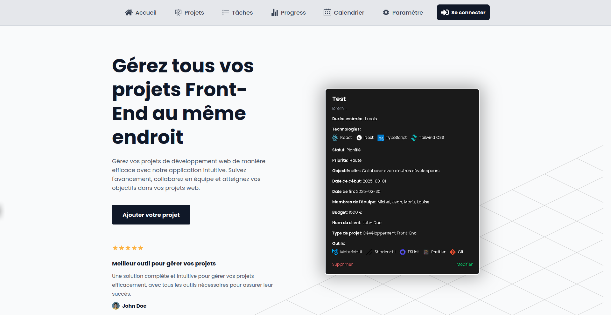

# 🚀 **Project Manager** – Empower Your Development Workflow 🚀

<div align="center">
  
</div>

---

## 🚧 **Status: In Development**

⚙️ This project is under **active development**. Features are being added and refined regularly to provide the best project management experience possible! Stay tuned! 🚀

---

## 📝 **Description**

**Project Manager** is a comprehensive web application tailored for frontend developers to manage their projects efficiently. Built with **React**, **TypeScript**, and **Tailwind CSS**, it delivers an intuitive interface for:

- 📊 Tracking project progress
- 📝 Managing tasks
- 📅 Organizing development workflows

💻 The dark-themed interface emphasizes user experience and productivity, suitable for both solo developers and teams.

---

## ✨ **Features**

### ✅ **Current Features**

#### 📊 **Project Dashboard**

- 🗂 Overview of all active projects
- 🕒 Quick access to recent activities
- 🚦 Project status indicators
- 📈 Progress tracking widgets

---

#### 📝 **Project Creation & Management**

- 🧙‍♂️ Intuitive project creation wizard
- 🗃️ Detailed project information forms
- 📝 Custom project templates
- 📦 Project archiving capabilities

---

#### 🏷️ **Project Status Tracking**

- 🔄 Real-time status updates
- 🛠️ Custom status definitions
- 🗓️ Status history tracking
- 📢 Automated status notifications

---

#### 💻 **Technology Stack Selection**

- 🧩 Predefined technology options
- ➕ Custom technology addition
- 🏷️ Visual technology badges
- ⚙️ Stack compatibility checking

---

#### ⏱️ **Duration Estimation**

- 📅 Timeline planning tools
- 🎯 Milestone setting
- 🕰️ Deadline tracking
- 🔔 Automated reminders

---

#### 🎯 **Project Objectives Setting**

- 🎯 SMART goal framework
- 📍 Objective tracking
- 📈 Progress indicators
- 🏆 Goal achievement metrics

---

#### 👥 **Team Member Management**

- 🧑‍💼 Team role assignment
- ✅ Member responsibility tracking
- 💬 Team communication tools
- 📊 Workload management

---

#### 💰 **Budget Tracking**

- 📝 Cost estimation tools
- 📉 Budget monitoring
- 💵 Expense tracking
- 📑 Financial reporting

---

#### 📅 **Project Timeline Management**

- 🗓️ Interactive timeline view
- 🔗 Dependency mapping
- ⚠️ Critical path identification
- 🔄 Timeline adjustments

---

### 🚀 **Planned Features**

#### 📋 **Kanban Board**

- 🧱 Customizable columns
- 🖱️ Drag-and-drop functionality
- 🔎 Task filtering and sorting
- 🏃 Sprint planning support

---

#### 📊 **Statistics & Analytics**

- 📈 Performance metrics
- 🕒 Time tracking analysis
- 🩺 Project health indicators
- 📑 Custom report generation

---

#### 📅 **Calendar Integration**

- 📆 Google Calendar sync
- 📋 Event management
- 🗓️ Deadline visualization
- 🕒 Meeting scheduling

---

#### 🔄 **Task Management**

- 🔗 Task dependencies
- 📌 Priority settings
- ⏲️ Time estimation
- 📈 Progress tracking

---

#### 📈 **Progress Tracking**

- 📉 Burndown charts
- ⚡ Velocity tracking
- 🏃‍♂️ Sprint metrics
- 📊 Team performance analytics

---

#### 🤝 **Team Collaboration Tools**

- 💬 Real-time chat
- 📂 Document sharing
- 📝 Comment threads
- 🔔 @mentions support

---

## 🛠️ **Tech Stack**

| 🧩 **Technology**    | 🔍 **Details**                                                                  |
| -------------------- | ------------------------------------------------------------------------------- |
| **Frontend**         | React 19.0.0: Functional components, hooks, optimized performance               |
| **Language**         | TypeScript 5.7.2: Type safety, improved developer experience                    |
| **Styling**          | Tailwind CSS 4.0.6: Custom design system, responsive layouts, dark mode support |
| **Routing**          | React Router v7: Client-side routing, protected routes, dynamic handling        |
| **State Management** | React Context: Centralized state, custom hooks integration                      |
| **Icons**            | React Icons: Comprehensive library, consistent styling                          |
| **Build Tool**       | Vite 6.1.0: Fast dev server, optimized builds, HMR support                      |
| **Package Manager**  | npm: Dependency management, automation, version control                         |

---

## 📂 **Project Structure**

```plaintext
├── public/            # Static files
├── src/               # Source code
│   ├── assets/        # Images, fonts
│   ├── components/    # Reusable components
│   ├── contexts/      # React contexts
│   ├── pages/         # Application pages
│   ├── hooks/         # Custom hooks
│   ├── styles/        # Tailwind configurations
│   └── utils/         # Helper functions
└── package.json      # Project metadata
```

---

<div align="center">
  🚀 *Manage your projects like a pro!* 🌟
</div>
